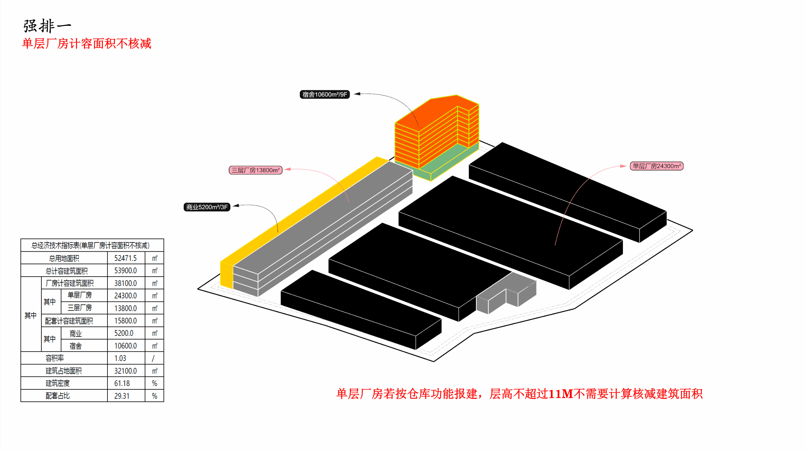
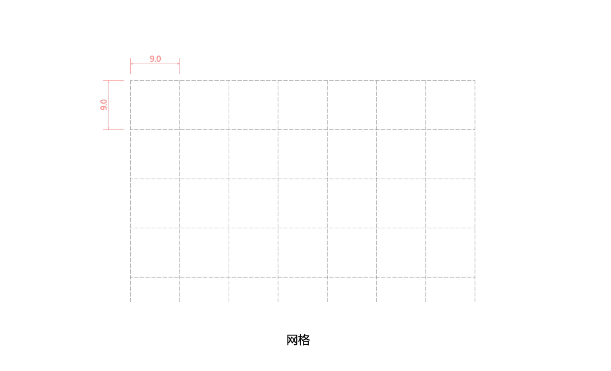
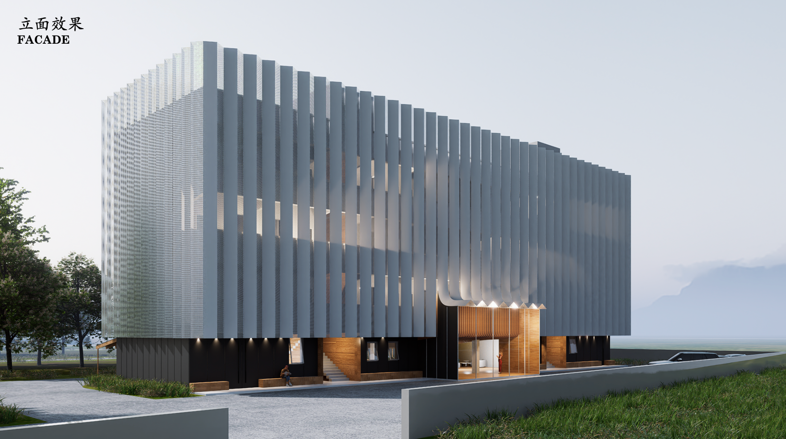

## 第一阶段成果汇总
### 方案文本构架261003
- 初期构想：
	- 城市中的公共性厂房
	- 仓储展厅（汽车或者体育体验设施）
	- 大跨度结构（灵活性）
	- 互动型光伏厂房
- 场地逻辑：
	- 基于城市格网（巴塞罗那）的理想布局构想，
	- 一种格网与柱网嵌套的逻辑组织
- 仓库规划：
	- 布置策略（方向，栋数，排练组织）
	- 体量逻辑（占地与高度的联系）
	- 灵活性策略
		- 厂房与商业的灵活共存
		- 仓储型与生产型厂房的互易性，
		- 短期开发与阶段性开发的可能性，
	- 场地设计
		- 出入口布置
		- 高差处理
- 环境设计：城市关系，与自然环境关系
- 交通规划：物流流线，机动车流线，人行
- 报建图纸：总图及指标，相关效果图，交通可行性分析，单体平面图，城市关系分析，竖向设计
- 
- 待确定：开口位置，规划经济指标，护坡方案

## 概念

### 城市设计block

### 环境互动型BIPV

### 大跨结构


## 总图研究
### 4栋厂房（1期）
- 20261003-初步确定的总图规划布局

```gallery


```
###  屋顶方向与综合楼高度
```gallery


```

## 强排对比
- 9x9m网格与平面布局
```gallery


```
- 宿舍位置与二期计量
```gallery


```
-

### 层高研究


### 指标比较
- 基于8m厂房层高与11m仓库层高的指标差异对比，得出30%配套指标

```gallery


```


## 合规性研究
### 总图消防与退距


### 消防疏散


### 交通研究


## 具体性问题

### 标准厂房模块




###  道路与竖向问题
- 场地标高取值（周边与场地内高差）
- 场地东西高差约6m，与物流场地需要平整
- 场地内高差取值控制在1%，道路控制住2%，


- 设计依据


### 结构与跨度研究
- 结构跨度与尺度

```gallery


```

### 屋顶图案光伏


### 仓储停车与作业


## 界面与立面
### 参考案例
- 东莞南星制造

- 大疆顺德制造
- 东莞嘉荣物流

### 城市界面
### 厂区界面


