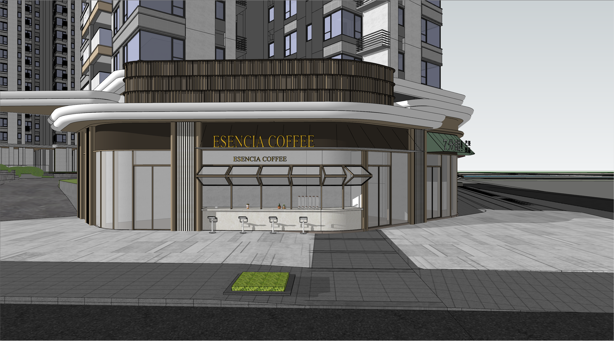
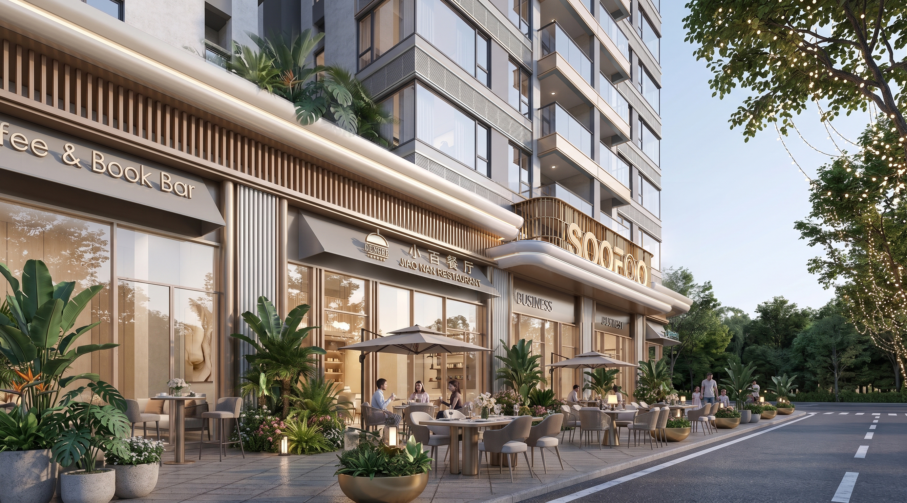
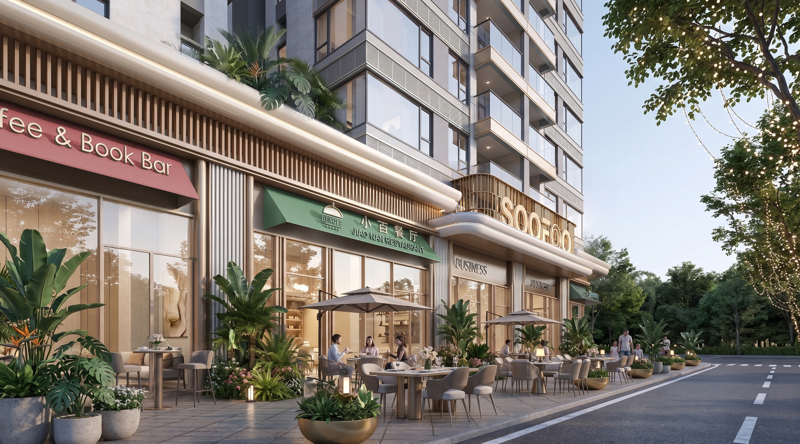
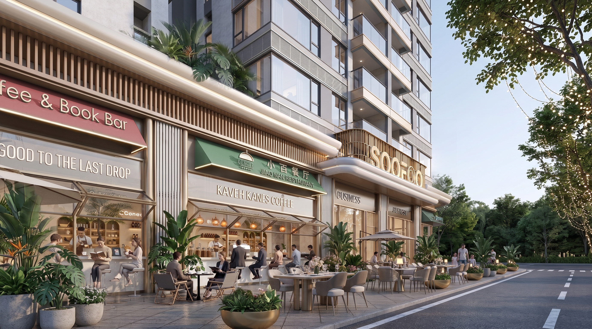

### 项目起源
配合瀚旅做一些立面优化，解决一些构造策略上的疑难杂症。同时也尝试一种新的工作合作模式。


### 甲方要求
20260907：对照cad调整消防车道与坡道结构，重点是核对结构图纸与su模型之间的冲突

20260905：
```gallery

```
20260904：

1- 商业立面模型调整，核对最新的cad图纸

2- 转角窗拓,增强商业氛围，调整3个不同的开启尺度
```gallery



```
3- 需解决：空调位置遮挡、转角窗弧形面难施工、高差处雨棚与招牌的协调、平面相应调整。

20260828：
```gallery



```


### 零碎想法
- 空调挡板：小尺度随机竖向百叶片，按某种规律旋转。


### AI出图探索
#### gmini 细节识别问题
因为gmini的2k限制，导致原来能直出高清渲染图的方式失效，如果要做局部修改就会变得很困难，比如效果图中某个局部，模型导图给gmini，gmini会自动压缩，导致识别模糊，从而生成图纸会大概率产生幻觉，我们用手工对齐的方式做了一些尝试
```gallery

```

#### 局部ai渲染提示
```gallery


```

### 表皮探索
#### 随机筛减与旋转构件


