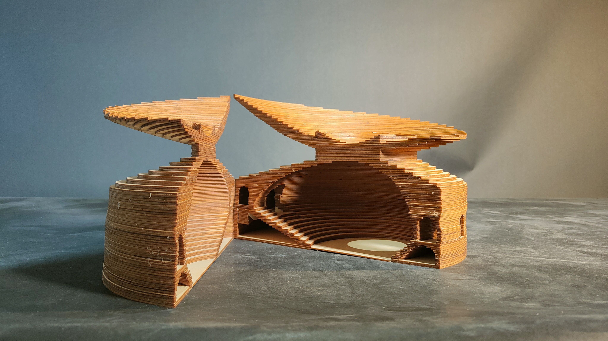
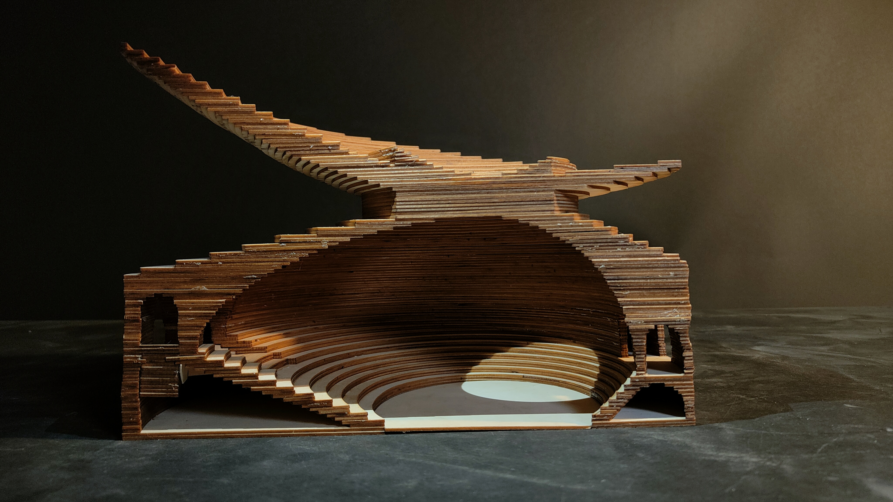
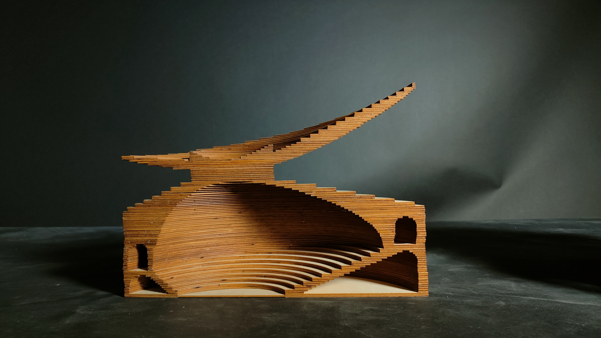
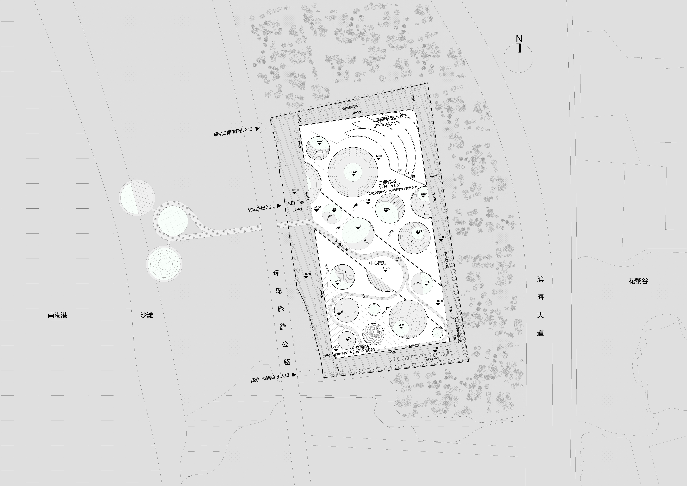
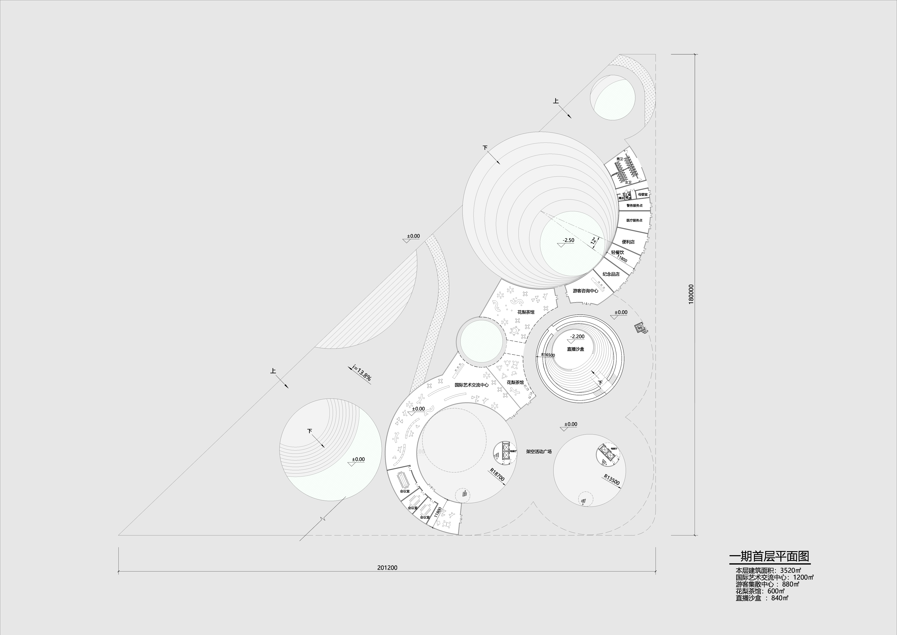
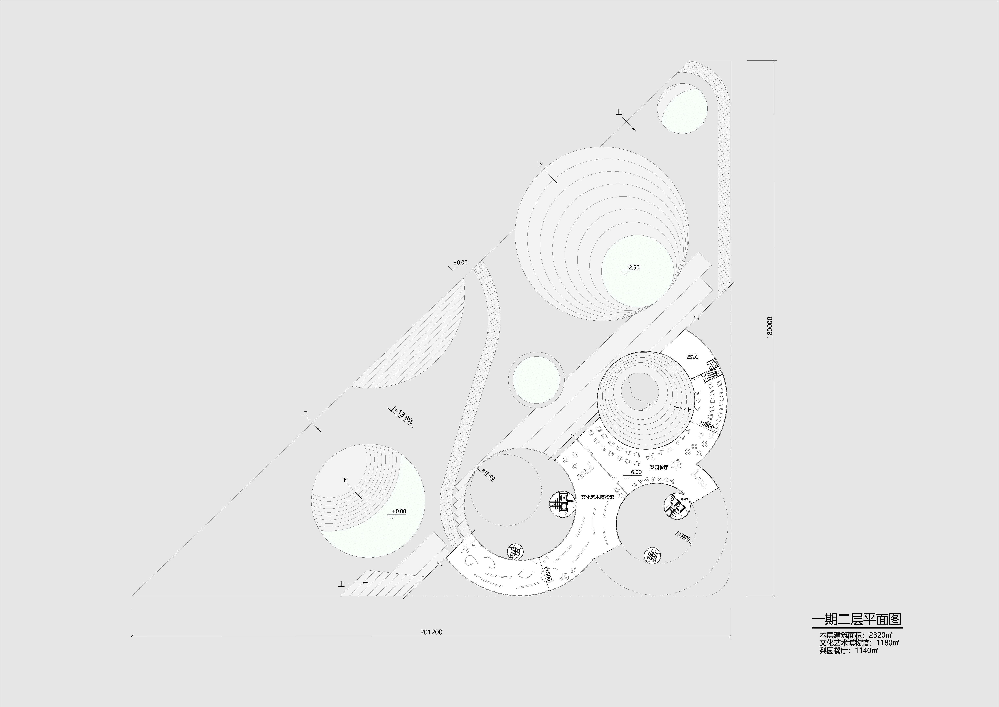
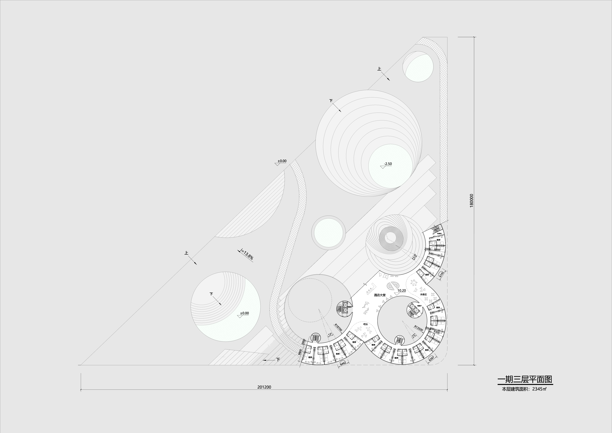
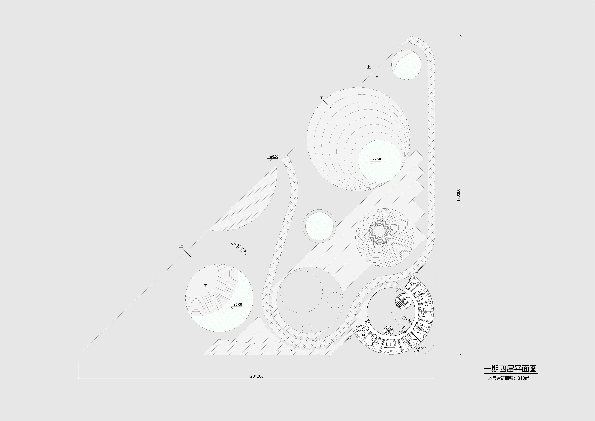
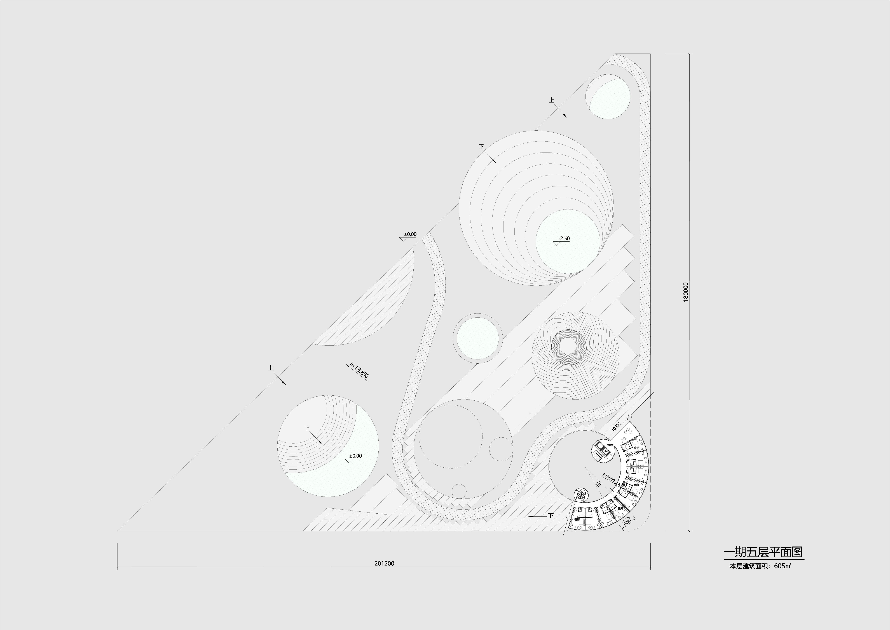

项目简介：项目位于新疆乌鲁木 气候 目标 技术

### 渲染


### 照片



### 模型
```gallery


```


### 功能分析


### 逻辑生成

```gallery


```


### 技术图纸 








### 动画 
待补充

### 过程 

#### 项目信息
- 项目类型：厂房 / Project Type: Factory Building
- 完成年份：2025 / Completion Year: 2025
- 建筑面积：139455 m² / Project Area: 139455 m²
- 主要材料：耐候钢、彩釉玻璃、铝板、碲化镉光伏组件 / Materials: Weathering Steel, CdTe PV Module
- 建筑功能：厂房、立体车库 / Functions: Stereo Parking Garage
- 业主：焱唐能源科技(杭州)有限责任公司 / Client: Yantang Energy