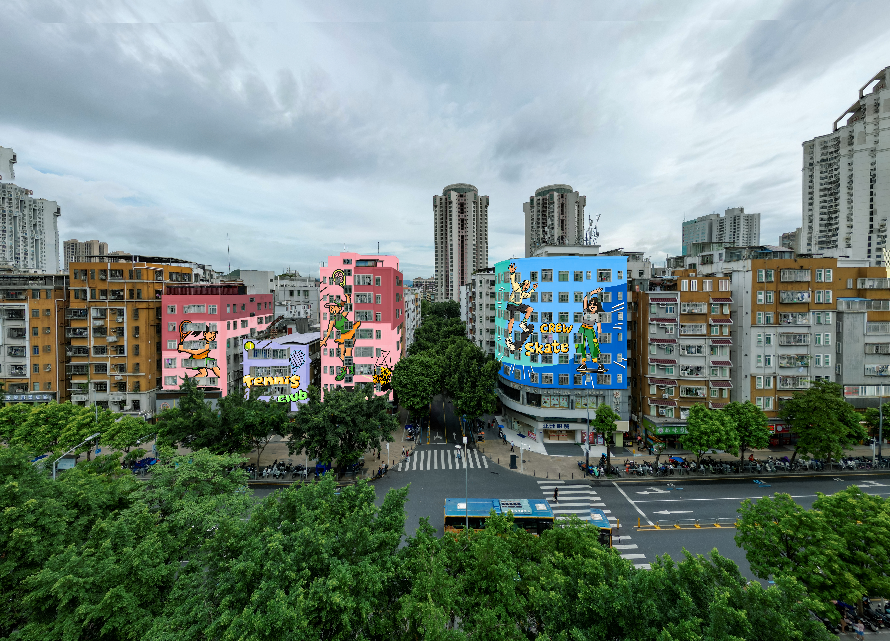
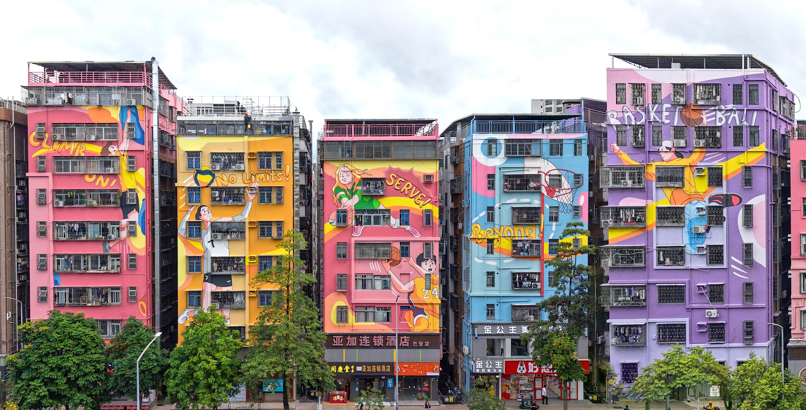

项目简介：依托"IN城市广场"运动公园IP，打造活力·运动主题街区典范焕新城市活力。

### 渲染

### 照片

### 分析 

### 技术图纸 

#### 项目信息
- 项目类型：旧改 / Project Type:Old-area Redevelopment
- 完成年份：2026 / Completion Year: 2026
- 建筑面积：3500 m² / Project Area: 3500 m²
- 主要材料：真石漆，外墙漆、硅胶灯带 / Materials: Real Stone Coating, Exterior Wall Paint, Silicone LED Strip Lights
- 建筑功能：住宅、商业 / Functions: Residential，Commercial
- 设计团队：开合设计/Design Team：Open & Link
- 业主：深圳市南园街道办 / Client: Nanyuan Subdistrict Office, Futian District, Shenzhen